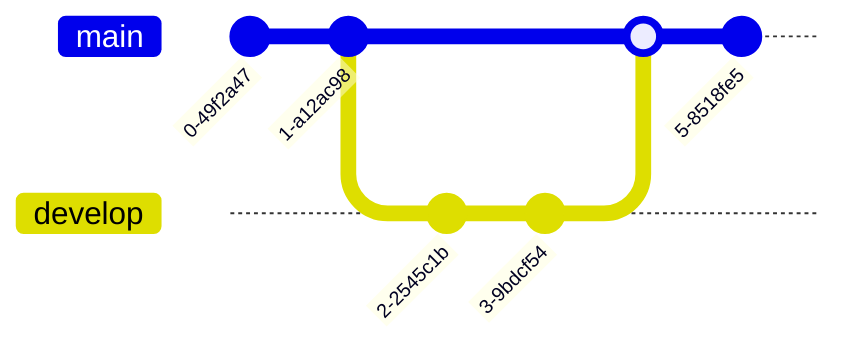

# Markdown Syntax

This is a comprehensive list of Markdown syntax along with examples for use in your README.md file, including Mermaid diagrams and code blocks for various programming languages.

## Table of Contents

1. [Headings](#headings-syntax)
2. [Lists](#lists-syntax)
3. [Links](#links-syntax)
4. [Images](#images-syntax)
5. [Blockquotes](#blockquotes-syntax)
6. [Inline Code](#inline-code-syntax)
7. [Code Blocks](#code-blocks-syntax)
8. [Tables](#tables-syntax)
9. [Horizontal Line](#horizontal-line-syntax)
10. [Bold and Italics](#bold-and-italics-syntax)
11. [Mermaid Diagrams](#mermaid-diagrams-syntax)


## Headings Syntax
```markdown
# Heading 1
## Heading 2
### Heading 3
#### Heading 4
##### Heading 5
###### Heading 6
```

### Example of Headings

# Heading 1
## Heading 2
### Heading 3
#### Heading 4
##### Heading 5
###### Heading 6


## Lists Syntax
**Unordered List:**
```markdown
- Item 1
- Item 2
  - Subitem 2.1
  - Subitem 2.2
- Item 3
```

**Ordered List:**
```markdown
1. First item
2. Second item
3. Third item
   1. Subitem 3.1
   2. Subitem 3.2
```

### Example of Unordered List

- Item 1
- Item 2
  - Subitem 2.1
  - Subitem 2.2
- Item 3

### Example of Ordered List

1. First item
2. Second item
3. Third item
   1. Subitem 3.1
   2. Subitem 3.2

## Links Syntax
```markdown
[GitHub](https://github.com/)
```

### Example of Links
[GitHub](https://github.com/)

## Images Syntax
```markdown

```

### Example of Images


## Blockquotes Syntax
```markdown
> This is a blockquote.
```

### Example of Blockquotes
> This is a blockquote.

## Inline Code Syntax
```markdown
Inline `code` example.
```

### Example of Inline Code
Inline `code` example.

## Code Blocks Syntax
Add ` ``` ` at the end of all code blocks Syntax.

**JavaScript:**
```markdown
```javascript
function greet() {
    console.log("Hello, world!");
}
greet();
```


**Python:**
```markdown
```python
def greet():
    print("Hello, world!")

greet()
```


**Shell:**
```markdown
```sh
echo "Hello, world!"
```


### Example of Code Blocks
**JavaScript:**
```javascript
function greet() {
    console.log("Hello, world!");
}
greet();
```


**Python:**
```python
def greet():
    print("Hello, world!")

greet()
```


**Shell:**
```sh
echo "Hello, world!"
```

## Tables Syntax
```markdown
| Header 1 | Header 2 | Header 3 |
|----------|----------|----------|
| Row 1    | Data 1   | Data 2   |
| Row 2    | Data 3   | Data 4   |
```

### Example of Tables
| Header 1 | Header 2 | Header 3 |
|----------|----------|----------|
| Row 1    | Data 1   | Data 2   |
| Row 2    | Data 3   | Data 4   |

## Horizontal Line Syntax
```markdown
---
```

### Example of Horizontal Line
---

## Bold and Italics Syntax
```markdown
**Bold Text**
*Italic Text*
***Bold and Italic Text***
```

### Example of Bold and Italics
**Bold Text**
*Italic Text*
***Bold and Italic Text***

### Mermaid Diagrams Syntax
Add ` ``` ` at the end of all mermaid diagrams Syntax.

**Flowchart:**
```markdown


**Sequence Diagram:**
```markdown


**Class Diagram:**
```markdown


**State Diagram:**
```markdown


**Entity Relationship Diagram:**
```markdown


**Gantt Chart:**
```markdown


**Pie Chart:**
```markdown


**Git Graph:**
```markdown


### Example of Mermaid Diagrams

**Flowchart:**


**Sequence Diagram:**


**Class Diagram:**


**State Diagram:**


**Entity Relationship Diagram:**


**Gantt Chart:**


**Pie Chart:**


**Git Graph:**

